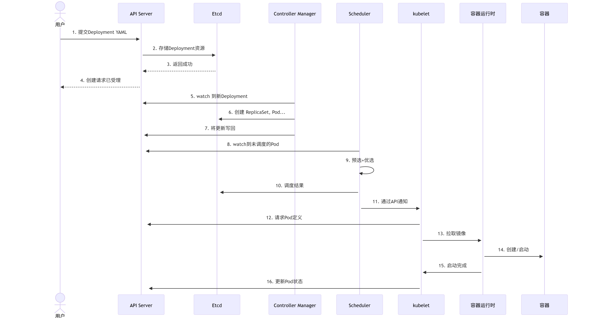

## **k8s**
NFS权限问题

configmap更新    双层软连接

##### kubernetes的集群有哪些组件 

##### 基于deployment创建Pod的流程 

##### 一个Pod从创建开始到删除的完整生命周期 

##### 从集群外基于ingress访问wordpress和后面mysql的完整过程

#### 通过ingress访问pod的流程
## **docker**
### docekr网络环境有几种

  